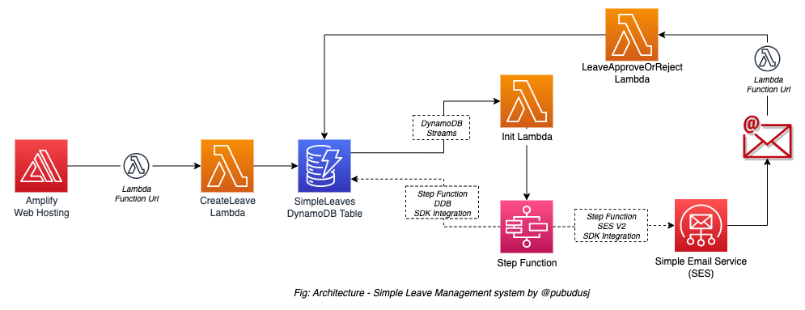
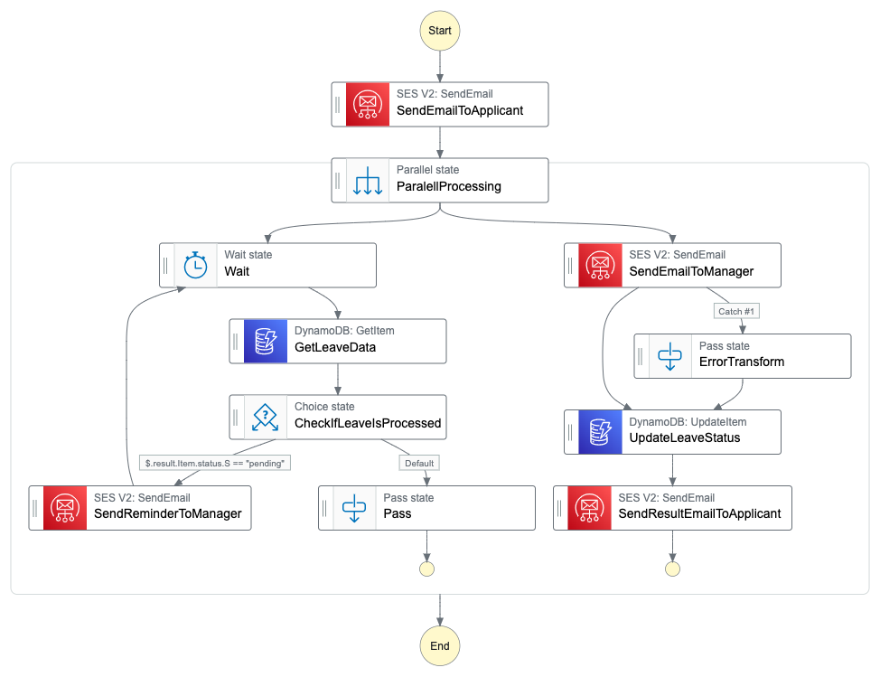

# Simple Leave Management with AWS Serverless

This project contains the source code required to set up the Simple Leave Management System built with AWS Serverless services.

### Architecture

### State Machine

More information and deployment instructions can be found at:
**[https://pubudu.hashnode.dev/simple-leave-management-system](https://pubudu.hashnode.dev/simple-leave-management-system)**
